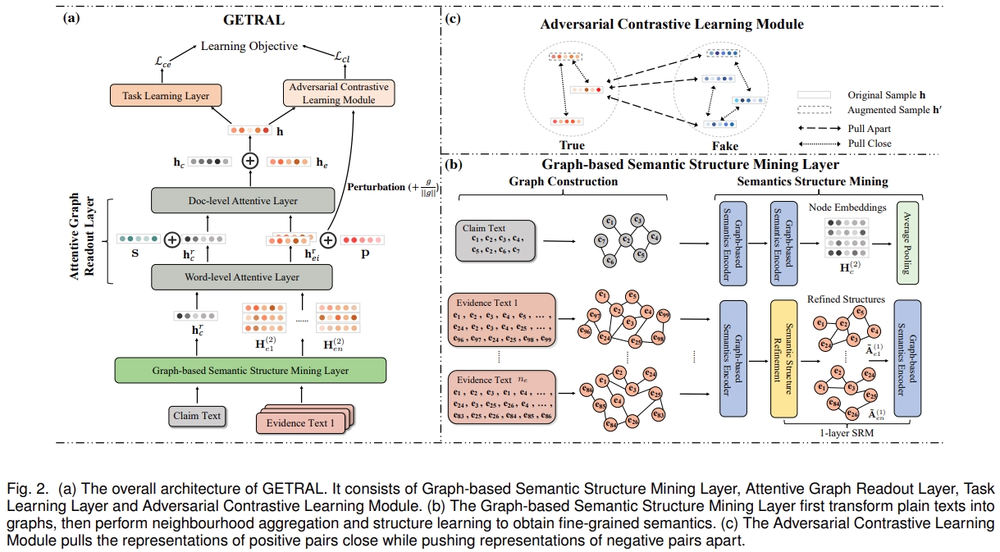

# GETRAL



This is the code for the IEEE TKDE Paper: [Adversarial Contrastive Learning for Evidence-aware Fake News Detection with Graph Neural Networks](https://arxiv.org/abs/2210.05498v1).

## Usage

 We utilize two widely used datasets. 

* Snopes: http://resources.mpi-inf.mpg.de/impact/dl_cred_analysis/Snopes.zip
* PolitiFact: http://resources.mpi-inf.mpg.de/impact/dl_cred_analysis/PolitiFact.zip


You can run the commands below to train our model on Snopes Dataset.

```
python MasterFC/master_mac.py --dataset="Snopes" \
                             --cuda=1 \
                             --fixed_length_left=30 \
                             --fixed_length_right=100 \
                             --log="logs/getral" \
                             --loss_type="cross_entropy" \
                             --batch_size=32 \
                             --num_folds=5 \
                             --use_claim_source=0 \
                             --use_article_source=1 \
                             --path="../formatted_data/declare/" \
                             --hidden_size=300 \
                             --epochs=100 \
                             --num_att_heads_for_words=5 \
                             --num_att_heads_for_evds=2 \
                             --gnn_window_size=3 \
                             --lr=0.0001 \
                             --gnn_dropout=0.2 \
                             --seed=123656 \
                             --alpha=0.5 \
                             --gsl_rate=0.7
```

You can also simply run the bash script.

```
sh run_snopes.sh
```

or

``` 
sh run_politifact.sh (on the PolitiFact dataset)
```


## Requirements

We use Pytorch 1.9.1 and python 3.6. Other requirements are in requirements.txt.

```
pip install -r requirements.txt
```

## Citation

Please cite our paper if you use the code:

```
@article{wu2022adversarial,
  title={Adversarial Contrastive Learning for Evidence-aware Fake News Detection with Graph Neural Networks},
  author={Wu, Junfei and Xu, Weizhi and Liu, Qiang and Wu, Shu and Wang, Liang},
  journal={arXiv preprint arXiv:2210.05498},
  year={2022}
}
```

## Acknowledge

The general structure of our codes inherits from the open-source codes of [MAC](https://github.com/nguyenvo09/EACL2021), we thank them for their great contribution to the research community of fake news detection.
